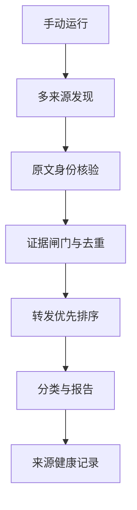

# 系统架构



## 稳定性设计

- **无定时依赖**：只有手动触发，不依赖常驻服务器。
- **最小依赖**：运行核心只使用 Python 标准库。
- **来源隔离**：单个来源失败不会破坏其他来源。
- **显式降级**：来源失败、指标缺失和榜单不足均写入报告。
- **原子输出**：报告先写临时文件，再替换正式文件，避免半成品。
- **并发保护**：GitHub Actions 同一时间只允许一次榜单运行。
- **确定性排序**：相同输入产生相同排名；不使用随机或不透明评分。

## 真实性设计

文章发现与互动指标分开处理。搜索结果只能说明“发现了某个链接”，不能证明转发或点赞数量。指标必须通过证据闸门：

```text
原始显示值 + 证据 URL + 观察时间 = 可验证指标
```

如果同一篇文章出现多个指标来源，系统按“证据等级 → 最新观察时间”选择，而不是选最大数字。

## 演进方式

核心契约保持稳定；上游变化通过新增或修复 adapter 处理。新增数据源必须带解析测试与失败样本。分类词表位于 `config/sources.json`，可以随时通过 Pull Request 更新。
